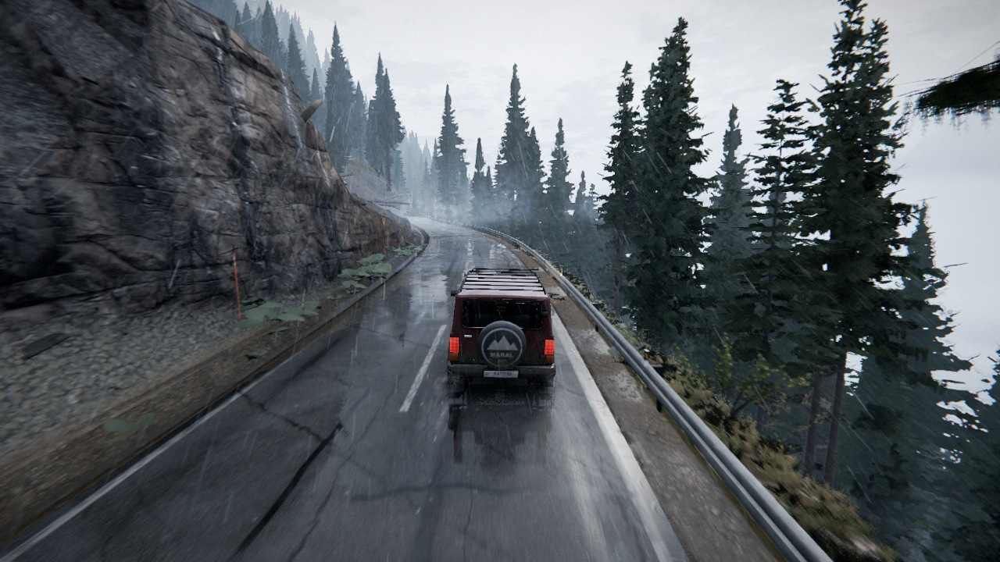
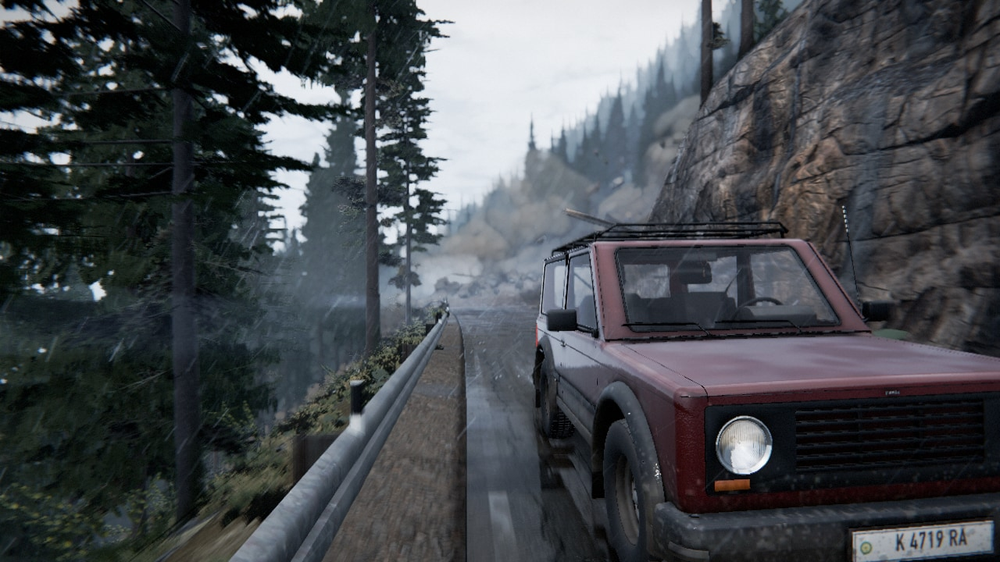
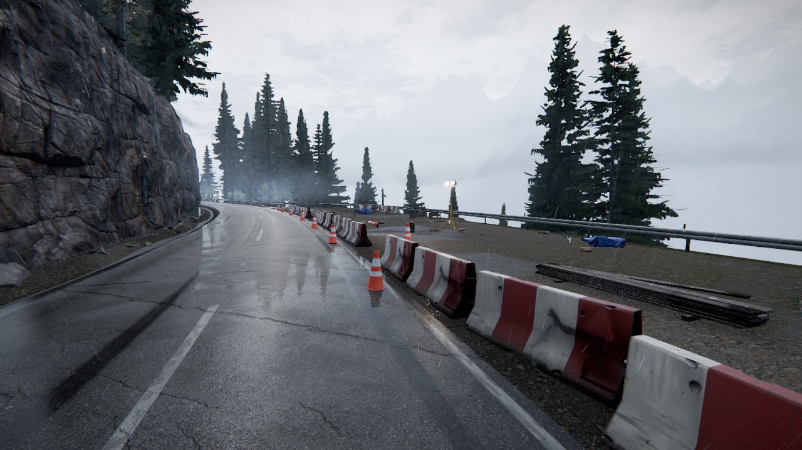
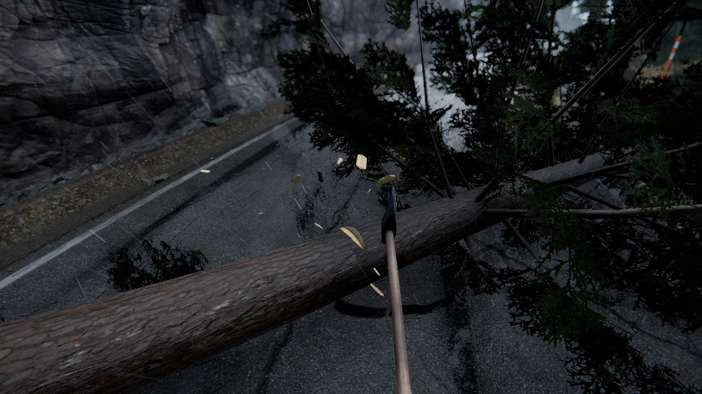
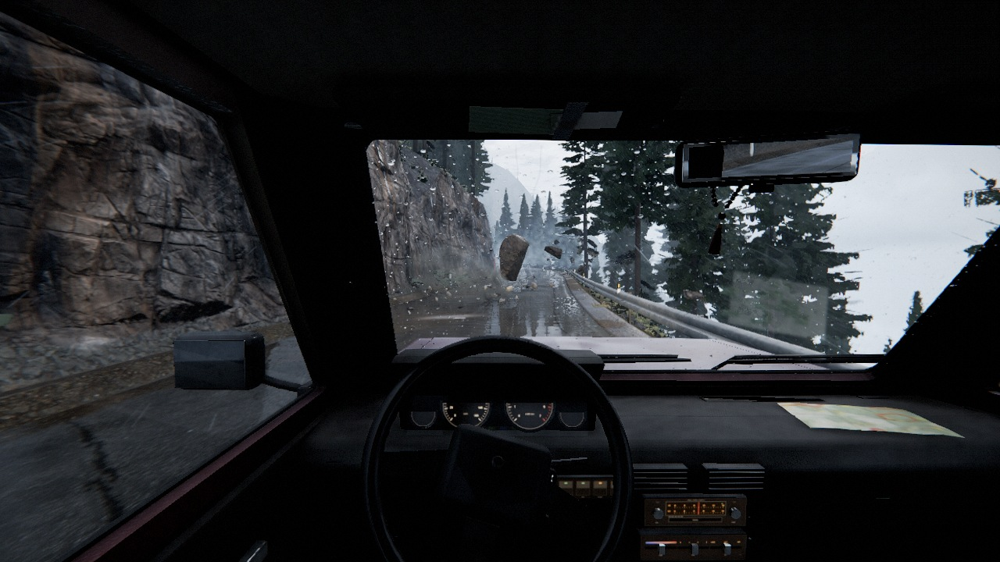
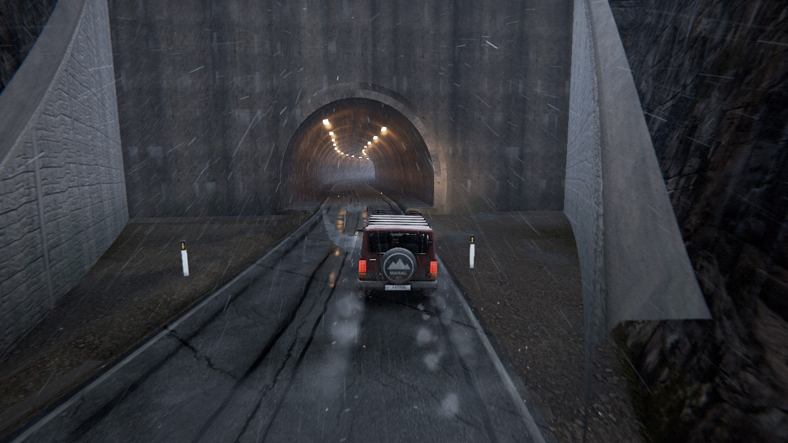

# LANDSLIDE

A short (5–8 minute) first-person escape game in the browser, aiming for the look of dashcam footage from a real Alpine or Himalayan mountain road in the rain.

It is a cold, wet afternoon, and you are driving an old 4x4 up a narrow cliff road. Behind you the slope lets go and boulders close the way back. Then the fuel runs out. On foot, you find a roadworks site with a jerrycan, a hatchet and a stack of scaffold planks. You cut through a spruce that has fallen across the road, refuel, and coax the engine back to life. Then you drive for your life while the mountain comes down around you. Boulders pour out of the gullies, the road is washed out, and your only way through is a tunnel in the rock spur ahead.



| | |
|---|---|
|  |  |
|  |  |
|  | |

*All screenshots are real-time captures at 1280×720 on the "High" preset.*

Built with three.js r186 (WebGL2), Rapier physics, pmndrs postprocessing and N8AO. **There are no downloaded 3D models.** The terrain, car, trees, rocks, props and tunnel are all built from scratch, either by Blender Python scripts or procedurally in JavaScript. All audio is synthesized at runtime. The only external assets are CC0 textures and one HDRI from [Poly Haven](https://polyhaven.com).

## Running it

You need Node.js 20.19+ or 22.12+ and a recent desktop browser with WebGL2. The game was developed and tested in Chrome.

```bash
npm install
npm run dev          # http://localhost:5173
```

Open **http://localhost:5173**, choose a graphics quality on the first screen (*Low* is preselected; see [Quality settings](#quality-settings)), and press **Start**. Click into the page to capture the mouse. Headphones are recommended.

Production build (static files, relative paths, so it can be hosted from any sub-folder):

```bash
npm run build        # -> dist/
npm run preview      # serves dist/ at http://localhost:4173
```

## Controls

| On foot | | Driving | |
|---|---|---|---|
| W A S D | move | W / S | throttle / brake, reverse |
| Mouse | look | A / D | steer |
| Shift | sprint | Space | handbrake |
| Space | jump | C | cockpit / chase camera |
| E | interact (hold to chop, pour, lay planks) | E | get in / out, start the engine |
| Tab | show the current objective | Esc | pause (settings, controls, retry) |

## Quality settings

**Quality screen.** When the game opens, a quality screen comes up before the renderer is created or any heavy file is downloaded, because the preset decides what gets downloaded. On a first visit *Low* is preselected, so any machine can start; the screen also suggests a preset for your GPU (read from the WebGL renderer string) and shows each preset's download size. Arrow keys and Enter work as well as the mouse. After **Continue** the screen fades into the loading screen. The choice is remembered in `localStorage` and preselected on the next visit; you can change it later on the title screen (*Settings → Graphics quality*, which reloads the page) or with `?quality=ultra|high|medium|low` in the URL. The screen is skipped for `?quality=`, `?autostart` and the fixed-camera debug flags, and after a choice made earlier in the same tab.

*Ultra* and *High* load the original full-quality assets. *Medium* and *Low* load lighter variants built by `node tools/make_variants.mjs` (`public/assets/q/`: WebP textures at 1024 px on Medium and 512 px on Low, except the asphalt and the cut-face rock, which keep 1024 px on Low, plus a 1k HDRI; the models keep their exact geometry, re-encoded losslessly with meshopt), and they lower the render resolution by themselves, in 10 % steps down to 55 %, if the frame rate stays under about 40 fps.

| Preset | Download | Render resolution | Sun shadow | AO | Wet-road reflections | Extras | Vegetation |
|---|---|---|---|---|---|---|---|
| **Ultra** | 89 MB | native, up to 2× DPR (Retina) | 4096², 70 m, lamp spot shadow | N8AO medium, full-res | screen-space, 20-step march (road + puddles) | camera motion blur at speed | grass 70 m, mesh trees 110 m |
| **High** | 89 MB | 1× CSS pixels | 2048², 60 m | N8AO low, half-res | screen-space, 10-step march (road) | camera motion blur at speed | grass 55 m, mesh trees 80 m |
| **Medium** | 33 MB | 0.8×, adaptive | 1024², 46 m | N8AO performance | screen "infinity" sample only | 1024 px textures; lighter terrain and road shaders | grass 40 m, mesh trees 55 m |
| **Low** | 23 MB | 0.65×, adaptive | 1024², 40 m | off | env map only | 512 px textures; no bloom, no volumetric mist; lighter terrain, road, fog and sky shaders | grass 28 m, mesh trees 35 m |

The download column counts the asset files (each file once). The code (JavaScript, WebAssembly, CSS) adds about 2.4 MB compressed. Loading the production build (`vite build` + `vite preview`, headless Chrome on the M1, network throttled to 25 Mbit/s, fresh cache, measured until the first frame of the game):

| Preset | Transferred | Time to the first frame at 25 Mbit/s |
|---|---|---|
| Low | 25.8 MB | 11.5 s |
| Medium | 35.0 MB | 15.8 s |
| High | 91.5 MB | 34.9 s |

The post chain is N8AO, a volumetric mist pass, a half-resolution history copy for the wet-road reflections, then a depth-of-field pass (Ultra and High only; on only during the rockfall cinematic and while you inspect an item on foot, with the blur matched to a real thin lens so it stays subtle), bloom, a lens model (slight barrel distortion, lateral chromatic aberration, veiling glare, off-axis softness), AgX tone mapping and a colour grade, then SMAA, vignette and film grain. Eye adaptation is driven by a centre-weighted exposure meter that behaves like a phone camera (the tunnel mouth stays a dark hole until you are inside). The presets live in `src/core/config.js`. Under the overcast sky shadows are soft anyway, so High renders the sun's shadow map at 2048² (`sunShadowMapSize`), which saves about 1 ms a frame on the M1 compared with 4096².

**Performance target:** at least 45 fps at 1280×720 on *High* on an Apple M1 (7-core GPU, 8 GB), within about 1.5 M triangles and 400 draw calls. The QA pass after the low-end work measured on a fanless MacBook Air M1 (headless Chrome, 1280×720, vsync-capped at 60 fps; the machine had been under GPU load for about three hours, so these are warm numbers). The low-end work did not change *Ultra* or *High*. Their terrain, road, tree, fog and sky shaders are byte-identical to the build before it; only the rockfall dust, tyre spray and rock-chip particle shaders differ, because a separate polish pass retuned them. Screenshots of the static scene at fixed viewpoints differ only by run-to-run noise (rain, film grain, wind), and the uncapped frame times below match the earlier measurements (19.4, 17.4, 19.3, 18.4 and 13.5 ms) within 0.2 ms.

Full automated playthroughs (`node scratch/game/playthrough.mjs --perf --quality=<preset>`), two runs per preset, average fps per section (lowest one-second sample in brackets). All four runs won with no console errors. Three had no deaths; one Low run lost the car once over the unguarded edge at the fallen tree (s = 302) and won from the checkpoint. A third Low run (not in the table) also won, after one rollover just inside the tunnel mouth (s = 1162).

| Section | High, run 1 | High, run 2 | High peak tris / calls | Low, run 1 | Low, run 2 | Low peak tris / calls |
|---|---|---|---|---|---|---|
| Intro drive, cockpit (s 40–175) | 60 (58) | 60 (60) | 1.9 M / 355 | 60 (60) | 60 (60) | 1.0 M / 226 |
| Rockfall cinematic (s 150–200) | 51 (46) | 52 (46) | 2.1 M / 363 | 58 (52) | 58 (52) | 1.0 M / 225 |
| Coasting to the stall (s 180–250) | 57 (50) | 58 (46) | 2.1 M / 371 | 60 (60) | 60 (60) | 1.1 M / 237 |
| On foot: stall, fallen tree, roadworks | 57 (47) | 54 (47) | 1.8 M / 358 | 60 (58) | 60 (60) | 1.0 M / 223 |
| Escape drive to the washout (s 250–545) | 60 (57) | 60 (59) | 2.0 M / 371 | 60 (60) | 60 (60) | 1.1 M / 274 |
| Washout: laying the planks on foot (s 550) | 50 (46) | 48 (45) | 1.4 M / 346 | 60 (60) | 60 (60) | 0.7 M / 184 |
| Escape drive past the gullies (s 550–1100) | 59 (48) | 59 (54) | 1.8 M / 388 | 60 (60) | 60 (60) | 1.0 M / 266 |
| Tunnel approach and win (s 1100–1180) | 60 (60) | 60 (60) | 1.0 M / 245 | 60 (60) | 60 (60) | 0.6 M / 148 |

Low sits at the 60 fps cap almost everywhere, so its headroom shows better in the uncapped frame time. `node scratch/qa/bench.mjs "<s>,-1.5,1.6,30" --quality=<preset> --tests=none` renders frames back to back at a fixed viewpoint with one sync at the end, so it includes about 2 ms of CPU submission that gameplay overlaps with the GPU. The fixed camera turns adaptive resolution off, so Medium and Low render at their nominal 0.8× and 0.65×.

| Uncapped frame time, 1280×720 | s = 150 (slide scar) | s = 305 (fallen tree) | s = 560 (washout) | s = 700 (gullies) | s = 1140 (tunnel portal) |
|---|---|---|---|---|---|
| High | 19.2 ms | 17.5 ms | 19.4 ms | 18.2 ms | 13.4 ms |
| Medium | 10.4 ms | 9.5 ms | 9.9 ms | 9.6 ms | 8.0 ms |
| Low | 5.1 ms | 4.9 ms | 4.9 ms | 4.7 ms | 4.2 ms |

Earlier QA passes on *High*: 50–52 fps at two viewpoints (s = 150, 560) after about 90 minutes of continuous load, and 38–41 fps in a full-screen 1440×900 window (1× DPR) while throttled. On a software rasteriser (Chrome with SwiftShader, no GPU) the Low preset still loads and runs with no errors, at a few frames per second.

The MacBook Air has no fan, so after 30–60 minutes of full GPU load it throttles and every number above drops by about 10 %. Frame rates also drop sharply if another app is using the GPU at the same time: in one session another app kept the GPU about 55 % busy, and the same build measured 36–49 fps on *High*. Choose *Ultra* on a faster GPU for Retina-native resolution, or *Medium* or *Low* on a warm, busy or older laptop.

## How it was made

### Rendering (`src/render/`)
- **Terrain:** a biplanar splat of nine scanned CC0 texture sets, packed into texture arrays and tiled at each scan's real capture size (0.2–2 m fracture blocks on the rock cut). It is driven by baked vertex masks (AO, gravel, mud, vegetation) plus slope and macro noise. The rain-wetness model darkens porous surfaces, leaves overhangs dry, and draws water on the rock faces: black cyanobacteria "ink stripes", live seeps, iron staining and calcite crusts below joints, sheet flow, blasting half-casts on the cut, and a soaked halo around each gully fall. The washout shows the road structure in section (asphalt, pale sub-base, brown fill). Far mountains get alpine zonation (turf, scree fans, rock bands, fresh snow). The tunnel lining ends in a concrete arch ring set into the headwall, so no sky shows through the seam around the tunnel mouth. Inside the tube a dark strip under the road closes the hairline seam where the road meets the kerbs, which used to let the sky through as a row of blue-white sparkles.
- **Road:** saw-cut repair patches and trench reinstatements with tar overbands, sealed and open cracks, alligator cracking, faded thermoplastic lines, polished wheel paths, rutted puddles with rain ripples, sheet flow and mud tongues below the gullies, and grit spilled from the slide. Screen-space reflections add a patchy water-film lobe, so the wet road reflects the real tree line, car and barriers, stretched vertically as on real wet asphalt.
- **Water:** thin running-water ribbons in the ditch and the gullies, with falls where the gullies meet the road cut. The rock around each fall is soaked dark and glossy (only the falls within about 220 m of the camera are evaluated).
- **Atmosphere:** global height fog and aerial perspective, done with ShaderChunk overrides so every material gets it. It adds valley mist sheets, a low cloud deck and sun in-scatter. The volumetric mist is ray-marched at reduced resolution and upsampled with a depth-aware 4×4 filter, so it stays smooth and shows no dither pattern. The sky dome and the image-based lighting both come from the 8k overcast HDRI.
- **Rain:** streaks drawn from a Marshall-Palmer drop-size distribution, each falling at its terminal velocity and smeared over the camera's exposure time, plus drifting rain veils, ground mist, splashes on the road, tyre spray, and refracting drops and a wiper-swept water film on the windshield in the cockpit view.
  - **Windshield beads:** each bead is a small inverted water lens (the sky shows in its lower half). The glass is about 0.7 m from a lens focused on the road, so it is blurred by about 5.5 mrad (about 3 px at 720p). Beads smaller than that blur fade in proportion, so the fine mist on the glass reads as a faint haze, not as bright pixel sparkles against the dark tunnel headwall.
  - **Photometry:** the far rain is calibrated to real coverage. At about 4 mm/h there are about 220 drops larger than 0.8 mm per m³, and each one covers a pixel for only about 1.5 % of a 1/55 s exposure. Rain beyond a few metres therefore shows as a faint, fine texture (mean opacity 0.5–1 %) against dark rock and trees, not as bright dashes.
  - **Tyre spray:** matched to a small car at 40–50 km/h on a film of water about 1 mm deep: a low, continuous haze behind each tyre, about 1 m high, that clears in about half a second. The heavier drops are a few centimetres across.
- **Dust:** rockfall dust has the albedo of the crushed rock itself (about 0.3 dry, 0.2 wet), so it reads about as bright as the concrete, well below the overcast sky. The rain thins it quickly.
- **Loading:** every shader is compiled during the loading screen, including the shadow-map variants of objects that only appear later (boulders, the chopped tree), so nothing stalls mid-game.
- **Forest:** thousands of instanced conifers (three Norway spruce variants, one silver fir and a dead snag). They go from LOD0 to LOD1 meshes, then to multi-view impostors rendered from the Blender trees, with dithered cross-fades, wind, and procedural grass and ferns near the camera.

### Gameplay and physics (`src/game/`, `src/physics/`, `src/world/`)
- **Car:** a Rapier `DynamicRayCastVehicleController` with a fuel model and a stalling engine.
- **Player:** a kinematic character controller. It can step over the fallen trunk.
- **Rockfall:** convex-hull boulders on a "fair" timing model, so rocks land where a sensible driver can still avoid them, plus a mud-and-debris front that chases you. From about 60 m before the tunnel, rocks only fall behind the car, so the approach to the portal stays clear. If a boulder rolls the car onto its roof, the run ends after 2.5 s with a "The car rolled over" screen, rather than leaving you stuck until the front arrives.
- **Interactions:** hold-to-use chopping (each blow widens a V notch in the trunk), refuelling and plank laying.
- **First-person hands:** rigged, gloved hands in rain-jacket sleeves (`tools/blender/hands.py`, sized to an adult hand in a work glove: 19.5 cm long, 9 cm across the palm) hold the hatchet, the jerrycan and the planks, with a wind-up, strike and camera kick for each blow.

### Audio (`src/audio/`)
Everything is procedural Web Audio: rain, wind, rumble, rock impacts, wood chops, footsteps on seven surfaces (asphalt, gravel, mud, rock, dirt, grass, wood), the fuel glug and the door clunk. The engine is an `AudioWorklet` synthesizer driven by rpm and load. One-shot sample banks are rendered in a Web Worker at start-up. There are no recorded samples.

### Assets: Blender scripts (`tools/blender/`)
Every model is generated by a deterministic, seeded Python script that runs headless in Blender 5.2 (it bundles numpy). Each script bakes its textures, writes a meshopt/WebP-compressed GLB into `public/assets/`, and renders preview images into `scratch/`. Re-running the scripts regenerates everything. Run one Blender process at a time; each needs up to about 2 GB of RAM.

```bash
B=/Applications/Blender.app/Contents/MacOS/Blender        # adjust for your OS
node tools/fetch_assets.mjs                                 # CC0 source textures + HDRI -> raw_assets/ (textures only, no models)
node tools/gen_road.mjs                                     # road centreline -> public/assets/world/road.json (frozen)
$B -b -P tools/blender/terrain.py                           # terrain.glb + scatter.json: cut face, slide scar, gullies, washout, tunnel
$B -b -P tools/blender/trees.py                             # trees.glb (spruce/fir LODs, fallen tree, shrubs) + impostor atlases
$B -b -P tools/blender/rocks.py                             # rocks.glb: fractured granite/gneiss boulders, hulls, pebbles
$B -b -P tools/blender/hands.py                             # hands.glb: gloved first-person hands in jacket sleeves, rigged, with poses
$B -b --factory-startup -P tools/blender/props.py           # props.glb: jerrycan, hatchet, planks, barriers, light tower, guardrail...
$B -b --python-exit-code 1 -P tools/blender/car.py          # car.glb + car.json: early-90s compact 4x4 with a full interior
node tools/sky.mjs                                          # sky-dome textures from the 8k HDRI
```

- `tools/blender/common.py` loads `road.json` and exposes the same road frame as the engine (`s` = distance along the road, `d` = signed lateral offset).
- The **needle cards** of the trees are rendered from procedural needle geometry.
- **Rock** normal, AO and cavity maps are baked from voxel-remeshed high-poly sculpts.
- The **car** paint wear, mud and rust are baked from procedural masks.
- Each script has options (`--stage`, `--only`, `--fast`, …) documented at its top.
- `public/assets/tex/` holds the engine's resized copies of the Poly Haven texture sets. `raw_assets/` (git-ignored) holds the full-size downloads that the Blender bakes and the sky tool read.

## Mobile (phones and tablets)

The game plays fully by touch on iOS Safari and Android Chrome, in landscape (a "Rotate your device" screen appears in
portrait and pauses the game). Touch mode is detected automatically; `?touch=1` / `?touch=0` force it either way.

- **On foot:** a floating move stick in the left part of the screen (push it all the way to sprint), drag on the right to
  look, plus **Interact** (appears with the prompt; hold it to chop, refuel or lay the planks), **Jump** and **Sprint**.
- **In the car:** a **Steer** slider on the left, **Gas** and **Brake / Reverse** pedals, handbrake, camera and
  **Get out / Get in** on the right.
- **Everywhere:** a **Pause** button (top right). Move, look and a button all work at the same time (multi-touch).
- **Layout:** every screen (quality choice, loading, title, pause, settings, death, win) fits small landscape phones,
  respects notches/safe areas, and never zooms or scrolls the page.
- **Performance:** on phones the quality screen suggests Low, and a mobile adjustment sits on top of every preset (lower
  render resolution, smaller shadow maps, lighter effects, automatic resolution scaling). Tablets can still choose
  High/Ultra. iOS audio unlocks on the first tap; a device that resets the graphics shows "Tap to reload"; a browser
  without WebGL2 gets a clear message.
- **Fairness:** touch controls are a little slower than a keyboard, so on touch devices the chasing mud front creeps
  slightly slower. Desktop difficulty is unchanged.

**Show FPS:** Settings has a *Show FPS* switch (off by default, remembered) that shows frames per second, frame time and
the worst frame of the last half second in the top-left corner, on desktop and mobile.

## CrazyGames

The game is ready to run inside the CrazyGames iframe (HTML5 SDK v3, loaded in `index.html`). All platform code is in
`src/core/platform.js`:

- **Standalone safe.** Every SDK call checks `SDK.environment`. It is `'disabled'` outside CrazyGames (e.g. on Vercel),
  where the SDK would throw, so the game behaves exactly as before. `'local'` (localhost) shows demo ads.
- **Loading / gameplay events.** `loadingStart` / `loadingStop` wrap the loading screen. `gameplayStart` / `gameplayStop`
  follow active play: stop on the title menu, pause menu, death, win and during ads.
- **Ads only at natural breaks.** A midgame ad is requested on *Retry* (after a death or from the pause menu) and on
  *Quit to title*, never during play. While the break runs, the game is held: paused, input off, pointer released, faded
  to black, menus ignored. Audio is suspended while the ad plays and the platform's `muteAudio` setting is respected.
  Rewarded ads are not used: the run is short with generous checkpoints, so there is nothing to grant.
- **`happytime`** fires when you escape into the tunnel.
- **No host scrolling.** Space, arrows, Page Up/Down, Home/End and the wheel are prevented from scrolling the host page
  (form controls and scrollable UI panels keep their normal behaviour).
- Ads are skipped on automated-test URLs (`?autostart`, `?skip`, `?cam`); add `?adtest` to force them locally.

## Debug and testing

URL flags (see `src/core/debug.js`):

| Flag | Effect |
|---|---|
| `?debug` | fps, draw-call and triangle overlay |
| `?autostart` | skip the title screen |
| `?skip=stall\|onfoot\|refuel\|escape\|gap\|gap_after\|tunnel` | start at a checkpoint |
| `?camS=s,d,h,ahead` | fixed camera relative to the road |
| `?freecam` | fly camera: WASD/QE, right-drag to look |
| `?only=env,terrain,…` | load only some systems |
| `?nopost` | no post-processing |
| `?mute` | no audio |
| `?quality=…` | pick a quality preset |

- `node tools/shot.mjs "/?autostart&debug&camS=300,-1.5,1.6,30" out.png` takes a headless-Chrome (GPU) screenshot and prints console errors plus frame stats.
- `node scratch/game/playthrough.mjs [--shots] [--perf] [--quality=high] [--base=http://127.0.0.1:4173]` plays the whole game automatically from the title to the win, and reports deaths, console errors and per-section fps. Pass `--quality=high` to measure *High*: without it the fresh headless browser profile starts on the *Low* preset, which is the default for a first-time player. Note that `scratch/` is git-ignored: these test scripts exist only in the local working copy, not in the repository.

## Project layout

```
index.html, src/main.js     boot + system registry (update order, fixed 60 Hz physics step)
src/core/                   config (quality presets, tuning), asset loader, road frame, input, events, debug flags
src/render/                 environment (sky, IBL, sun), fog, materials, terrain/road shaders, trees/impostors, grass, post
src/world/                  terrain, vegetation, props, landslide, particles
src/physics/                Rapier world, vehicle, character
src/game/                   game sequence and checkpoints, interactions, inventory, camera rig
src/audio/                  procedural audio (worklet engine, worker-rendered banks, DSP)
src/ui/                     HUD, title/pause/death/win screens, analog gauges
tools/                      Blender scripts, asset fetch, road generator, sky builder, screenshot tool
public/assets/              GLBs, textures, sky, road/scatter data
DESIGN.md                   the design contract (world space, APIs, asset contracts, budgets)
```

## Credits

- **Textures and HDRI:** [Poly Haven](https://polyhaven.com), [CC0](https://creativecommons.org/publicdomain/zero/1.0/).
  - HDRI: *overcast_soil_puresky*.
  - Textures: *asphalt_02, aerial_rocks_02, aerial_grass_rock, lichen_rock, dark_rock_02, marble_cliff_03, gray_rocks, mossy_rock, quarry_wall, rock_01, brown_mud_rocks_01, brown_mud_02, brown_mud_03, mud_forest, rocky_trail, forest_ground_04, precast_concrete_wall, concrete_wall_006, pine_bark, rough_wood, ash_veneer, hessian_230, rust_coarse_01*.
  - Bake-only sources (read by the Blender scripts from `raw_assets/`, baked into the models' own textures, not shipped as separate files): *brown_leather* and *stretch_poplin* (the gloves and sleeves in `hands.glb`), *knotted_pine_bark* (the fallen spruce in `trees.glb`).
- **Made from scratch for this project:** all 3D models (the car, trees, rocks, props, the tunnel), the terrain, and all audio.
- **Libraries:** [three.js](https://threejs.org) (MIT), [Rapier](https://rapier.rs) (Apache-2.0), [postprocessing](https://github.com/pmndrs/postprocessing) (Zlib), [N8AO](https://github.com/N8python/n8ao) (ISC), [Vite](https://vite.dev) (MIT).
- **Font:** [Barlow](https://fonts.google.com/specimen/Barlow) (SIL OFL), loaded from Google Fonts with an offline fallback.
